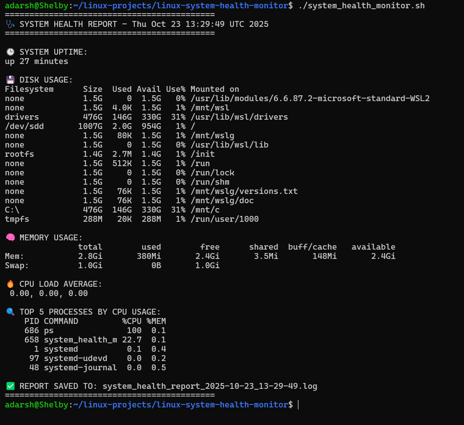

# 🩺 Linux System Health Monitor

### 👨‍💻 Author
**Adarsh Shivan**<br>GitHub: [https://github.com/adarshshivan](https://github.com/adarshshivan)

---

## 📘 Overview
The **Linux System Health Monitor** is a Bash-based automation script that generates a detailed system report containing CPU load, memory usage, disk utilization, uptime, and top resource-consuming processes.
It is a lightweight and portable tool designed for Linux users and system administrators to monitor system health directly from the terminal.

---

## 🧰 Features
- Displays system uptime, CPU load, memory usage, and disk usage
- Lists top 5 CPU-consuming processes
- Automatically creates a timestamped system health report log file
- Runs efficiently using built-in Linux utilities (no dependencies)
- Works on any Linux-based system (Ubuntu, WSL, etc.)

---

## ⚙️ Tools & Technologies Used
- 🐧 Linux / WSL (Ubuntu)
- 💻 Bash Scripting
- 📊 df, free, ps, and uptime commands
- 🧾 GitHub (for version control)
- ✍️ VS Code / Nano (for editing scripts)

---

## 🧩 How It Works
1. The script starts by generating a timestamp for log naming.
2. It collects key system information — uptime, disk, memory, and CPU usage.
3. It fetches the top 5 processes consuming the most CPU.
4. All results are printed on the terminal and saved to a log file:
5. system_health_report_YYYY-MM-DD_HH-MM-SS.log
6. The script provides a clean, sectioned output for easy readability.

---

## ▶️ Usage Instructions

### 1️⃣ Make It Executable (Optional)
```bash
chmod +x system_health_monitor.sh
```

### 2️⃣ Run the Script
```bash
bash system_health_monitor.sh
```

or (if executable):

```bash
./system_health_monitor.sh
```

---

### 📂 Example Output

▶️ After Running



---

### 🎓 What I Learned

- How to use df, free, ps, and uptime effectively for monitoring
- Logging data dynamically using Bash redirection and tee
- Organizing output with readable terminal formatting
- Automating system health checks
- Creating and documenting real-world Bash automation scripts

---

### 🧠 Project Summary

The Linux System Health Monitor is a practical Bash automation project that efficiently gathers and logs key system statistics — CPU, memory, disk usage, and top processes — into a structured report.
It demonstrates core Linux administration skills, process management, and log handling using only native shell commands.

This project demonstrates proficiency in:

Linux system monitoring commands

Bash scripting and process handling

Automated log file generation
